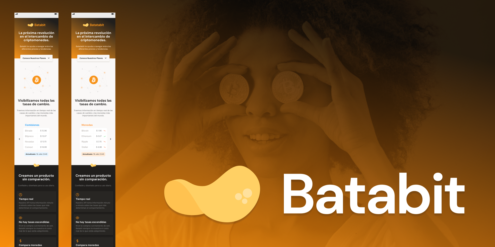

# [Curso de Responsive Design: Maquetación Mobile First](https://platzi.com/cursos/mobile-first/) 

_(Ctrl + Click or Middle-click to open in a new tab)_

Este repositorio contiene todo el material y código fuente que he desarrollado durante el **Curso de Responsive Design: Maquetación Mobile First**. 
En donde he desarrollado un sitio web con Responsive Design y Mobile First. He aprendido a utilizar wireframes, crear estilos globales en CSS y a aplicar "media queries" para garantizar que mi proyecto se vea bien en cualquier dispositivo. Además he usado Figma como herramienta de prototipado durante la realización del código fuente además de Lighthouse.

## 🚀 ¿Qué contiene?
- Archivo HTML
- Estilos CSS
- Proyecto final: una landing page
- Notas personales y recursos adicionales

## 📸 Vista previa

## 🛠️ Tecnologías utilizadas
- HTML5
- CSS3
- Git y GitHub

## Estructura del proyecto:
📦 Curso de Responsive Design: Maquetación Mobile First
.
├── README.md
├── assets
│   ├── icons
│   │   ├── button_icon_right_arrow.svg
│   │   ├── icon-check-circle.svg
│   │   ├── icon-clock.svg
│   │   ├── icon-dollar-sign.svg
│   │   ├── icon-eye.svg
│   │   ├── icon_arrow_down.svg
│   │   ├── icon_blur_left_arrow.svg
│   │   ├── icon_blur_right_arrow.svg
│   │   ├── icon_left_arrow.svg
│   │   ├── icon_right_arrow.svg
│   │   ├── trending-down 1.svg
│   │   └── trending-up 1.svg
│   └── img
│       ├── Bitcoin.svg
│       ├── bitcoinbaby.png
│       ├── logos
│       │   ├── iso-batata-bit.svg
│       │   ├── logo-batatabit.svg
│       │   └── logo-footer-batatabit.svg
│       └── screenshot-preview-project.png
├── index.html
├── styles
│   └── main.css
└── tree.txt

5 directories, 22 files

## 📚 Resources / References
- Plataforma: [Platzi](https://platzi.com)
- Enlace del curso: [Curso de Responsive Design: Maquetación Mobile First](https://platzi.com/cursos/mobile-first/)

## ✍️ Autor
Hecho con 💚 por @avidevcode
